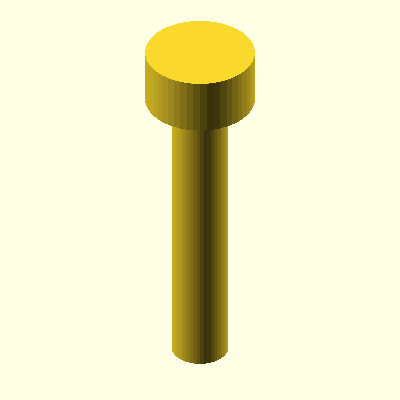

# oomlout_oobb_version_5

Working repository for OOBB part and shape generation.

This repo appears to be the workshop version of the OOBB generator rather than a packaged end-user release. It contains the Python/OpenSCAD tooling, component definitions, dimensional data, generated previews, and migration scaffolding used to build and document OOBB geometry.

## What This Repo Is For

- Developing and tuning OOBB geometry and fastener/component helpers
- Discovering components from per-folder `working.py` files under `components/`
- Rendering OpenSCAD outputs and preview images
- Generating JSON, HTML, and Markdown documentation for components
- Keeping migration and regression tests around while the codebase is being restructured

## What This Repo Contains

- Core runtime modules such as `oobb.py`, `opsc.py`, and `oobb_variables.py`
- `components/` with 60+ component folders, each centered on a `working.py`
- Generated per-component docs such as `components/*/README.md` and `components/*/documentation_detail.html`
- Test coverage under `tests/` plus generated test artifacts in `tests/test_runs/`
- CSV-backed reference data in `data/oring/`
- Archived legacy code and migration notes in `old/`

## Quick Tour

- [`oobb.py`](./oobb.py): main OOBB runtime, variable access, dispatch, and part-building helpers
- [`opsc.py`](./opsc.py): OpenSCAD/SolidPython rendering pipeline and image generation helpers
- [`oobb_variables.py`](./oobb_variables.py): shared dimensional data, tolerances, screw sizes, bearings, and mode-specific values
- [`components/`](./components/): component library, per-component docs, tests, and discovery-based tooling
- [`components/documentation.py`](./components/documentation.py): exports JSON/HTML/Markdown documentation
- [`components/run_tests.py`](./components/run_tests.py): per-folder object/set test runner
- [`components/generate_all_component_tests.py`](./components/generate_all_component_tests.py): regenerates component preview assets
- [`templates/`](./templates/): documentation templates used by the batch scripts
- [`data/`](./data/): supporting data, including O-ring CSV tables and sample architecture experiments
- [`tests/`](./tests/): regression tests, snapshots, and generated reports
- [`old/`](./old/): archived code, migration helpers, and the current `oobb_arch` compatibility path

## Installation / Setup

Setup is currently manual.

```powershell
python -m venv .venv
.venv\Scripts\Activate.ps1
python -m pip install --upgrade pip
python -m pip install -r requirements.txt
```

Also install OpenSCAD and make sure `openscad` or `openscad.com` is available on `PATH`.

Notes:

- The rendering pipeline in [`opsc.py`](./opsc.py) shells out to OpenSCAD for `.scad` and preview image generation.
- Some older scripts appear to expect adjacent local tooling or paths, including OOMP/`oomB`, generated-parts repos, and Windows-specific absolute paths.
- The component/documentation system currently imports `oobb_arch` from [`old/`](./old/), which is intentional in this repo state.

## Examples

Representative preview images already checked into the repo:

### `oobb_screw`



### `rounded_rectangle`


More examples live under `components/*/test/`.

## Documentation Generation

Documentation output is generated into:

- [`components/documentation_data.json`](./components/documentation_data.json)
- [`components/documentation.html`](./components/documentation.html)
- per-component `README.md` files under `components/*/`
- per-component `documentation_detail.html` files under `components/*/`

The batch scripts regenerate those outputs and, in the `all` variant, also refresh component preview/test assets before regenerating docs again.

## Related Repositories

- [`oomlout/oomlout_oomp_version_5`](https://github.com/oomlout/oomlout_oomp_version_5): appears to be related OOMP data/tooling used elsewhere in the Oomlout stack
- [`oomlout/oomlout_roboclick`](https://github.com/oomlout/oomlout_roboclick): related automation/action repo; this repo includes `data/sample architecture/` material that references RoboClick-style actions

## Notes / Current State

- This repo is mid-transition from older generator code to a per-component discovery architecture.
- `old/` is not just archive material; some live compatibility imports still come from there.
- A few scripts still contain hard-coded Windows paths or references to older generated-parts repositories.
- Some generated `.scad` test artifacts contain absolute include paths, so this repo is best treated as a developer/workshop environment rather than a clean portable package.
