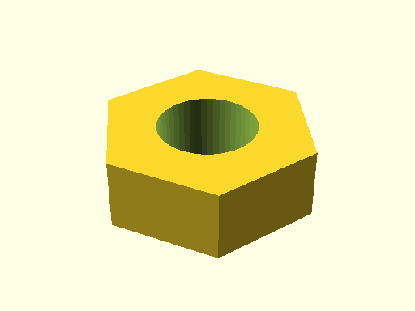
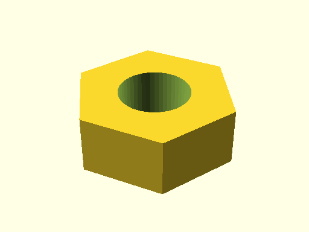

# Test Report: `test_file_generation.ScadGenerationMatrixTests.test_capability_fasteners_connectors`

- Status: **PASS**
- Timestamp: `2026-03-29T14:34:23`
- Artifact folder: `C:/gh/oomlout_oobb_version_5/tests/test_runs/test_file_generation_ScadGenerationMatrixTests_test_capability_fasteners_connectors`

## Notes

Capability: `capability_fasteners_connectors`
Artifact output: `C:/gh/oomlout_oobb_version_5/tests/test_runs/test_file_generation_ScadGenerationMatrixTests_test_capability_fasteners_connectors/capability_fasteners_connectors/generated`
Buildable item types covered: `4`
Compared SCAD files: `12`
Compared JSON files: `12`
Compared YAML files: `12`
Compared TXT files: `12`
Compared PNG files: `12`

## Rendered previews

### oobb_part_nut_m1d5_radius_name/3dpr.png

### oobb_part_nut_m1d5_radius_name/laser.png

### oobb_part_nut_m1d5_radius_name/true.png

### oobb_part_screw_countersunk_m3_radius_name_8_depth/3dpr.png

### oobb_part_screw_countersunk_m3_radius_name_8_depth/laser.png

### oobb_part_screw_countersunk_m3_radius_name_8_depth/true.png

