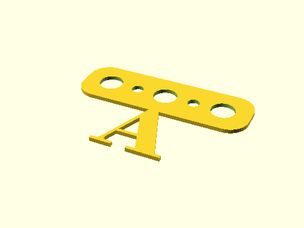
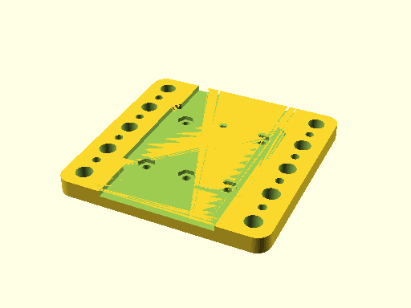

# Test Report: `test_file_generation.ScadGenerationMatrixTests.test_capability_holders_storage`

- Status: **FAIL**
- Timestamp: `2026-03-29T14:34:31`
- Artifact folder: `C:/gh/oomlout_oobb_version_5/tests/test_runs/test_file_generation_ScadGenerationMatrixTests_test_capability_holders_storage`

## Notes

Capability: `capability_holders_storage`
Artifact output: `C:/gh/oomlout_oobb_version_5/tests/test_runs/test_file_generation_ScadGenerationMatrixTests_test_capability_holders_storage/capability_holders_storage/generated`
Buildable item types covered: `5`
Compared SCAD files: `15`
Compared JSON files: `15`
Compared YAML files: `15`
Compared TXT files: `15`
Compared PNG files: `15`

## Rendered previews

### oobb_part_bunting_alphabet_3_width_1_mm_depth_a_extra/3dpr.png

### oobb_part_bunting_alphabet_3_width_1_mm_depth_a_extra/laser.png

### oobb_part_bunting_alphabet_3_width_1_mm_depth_a_extra/true.png

### oobb_part_jig_tray_03_03_5_width_5_height_6_mm_depth/3dpr.png

### oobb_part_jig_tray_03_03_5_width_5_height_6_mm_depth/laser.png

### oobb_part_jig_tray_03_03_5_width_5_height_6_mm_depth/true.png

## Changed bits

### png_hashes
- changed `oobb_part_smd_magazine_lid_2_width_2_height/3dpr.png`\n  - expected: `72a648160f3903cc29fb2acbc662381447312300e9fd0472f8a93b9236212fd6`\n  - actual:   `d787dc27192beb8d671d8b1d5616031d6f4111a4c485c9197f085031199e19af`
- changed `oobb_part_smd_magazine_lid_2_width_2_height/laser.png`\n  - expected: `856b4f5f06386e7747a139eb320c3a66e30d84e939c00b2fa29ccba3c778f947`\n  - actual:   `bc5206355bc073633d1574cac9f6178aa5cceedbc5747c001a496f43a1071a37`
- changed `oobb_part_smd_magazine_lid_2_width_2_height/true.png`\n  - expected: `bc5206355bc073633d1574cac9f6178aa5cceedbc5747c001a496f43a1071a37`\n  - actual:   `856b4f5f06386e7747a139eb320c3a66e30d84e939c00b2fa29ccba3c778f947`
### capability_holders_storage
- changed `png_hashes`\n  - expected: `{'oobb_part_bunting_alphabet_3_width_1_mm_depth_a_extra/3dpr.png': '4108f8dfcf48f8fcb60c7161581d5440492c48858d67c49ed2d6c586f2ec1d38', 'oobb_part_bunting_alphabet_3_width_1_mm_depth_a_extra/laser.png': '4d5a4e49724d28683343fe515ce685a63e3d0e4fe7c920f1011be52b37f33c60', 'oobb_part_bunting_alphabet_3_width_1_mm_depth_a_extra/true.png': '4d5a4e49724d28683343fe515ce685a63e3d0e4fe7c920f1011be52b37f33c60', 'oobb_part_jig_tray_03_03_5_width_5_height_6_mm_depth/3dpr.png': 'bedaecee28bf61f4db729ccca25e084e3f1769d34280f76f8d79735aec9500bf', 'oobb_part_jig_tray_03_03_5_width_5_height_6_mm_depth/laser.png': '9095f558590e492034769bd5415923b1822ee508f35543b0ba49966ff79929ee', 'oobb_part_jig_tray_03_03_5_width_5_height_6_mm_depth/true.png': '9095f558590e492034769bd5415923b1822ee508f35543b0ba49966ff79929ee', 'oobb_part_smd_magazine_lid_2_width_2_height/3dpr.png': '72a648160f3903cc29fb2acbc662381447312300e9fd0472f8a93b9236212fd6', 'oobb_part_smd_magazine_lid_2_width_2_height/laser.png': '856b4f5f06386e7747a139eb320c3a66e30d84e939c00b2fa29ccba3c778f947', 'oobb_part_smd_magazine_lid_2_width_2_height/true.png': 'bc5206355bc073633d1574cac9f6178aa5cceedbc5747c001a496f43a1071a37', 'oobb_part_th_tool_holder_basic_7_width_10_height_66_mm_depth/3dpr.png': 'f38be3ba7dbada8a1cc7aae8f26d26f112cbfd48ff2bb2cb3960ed1336745c73', 'oobb_part_th_tool_holder_basic_7_width_10_height_66_mm_depth/laser.png': '1b68bb6b235f7ea09242af36d63d75cf146381656368104a2c7f8970a30552b6', 'oobb_part_th_tool_holder_basic_7_width_10_height_66_mm_depth/true.png': '1b68bb6b235f7ea09242af36d63d75cf146381656368104a2c7f8970a30552b6', 'oobb_part_tray_1_width_1_height_9_mm_depth/3dpr.png': 'bbec85540586d15de3fbe48642060aabae13d9aa6f5c63272cdd365897e695d1', 'oobb_part_tray_1_width_1_height_9_mm_depth/laser.png': '34a7ee4a64dfeabf651c2e75f8790887b26b731755b9d8282f372f6d734a3b6f', 'oobb_part_tray_1_width_1_height_9_mm_depth/true.png': '49f700c5d9a847c5f0612859ebfcbf9636d5727c49a312cd1037d062dd92f24c'}`\n  - actual:   `{'oobb_part_bunting_alphabet_3_width_1_mm_depth_a_extra/3dpr.png': '4108f8dfcf48f8fcb60c7161581d5440492c48858d67c49ed2d6c586f2ec1d38', 'oobb_part_bunting_alphabet_3_width_1_mm_depth_a_extra/laser.png': '4d5a4e49724d28683343fe515ce685a63e3d0e4fe7c920f1011be52b37f33c60', 'oobb_part_bunting_alphabet_3_width_1_mm_depth_a_extra/true.png': '4d5a4e49724d28683343fe515ce685a63e3d0e4fe7c920f1011be52b37f33c60', 'oobb_part_jig_tray_03_03_5_width_5_height_6_mm_depth/3dpr.png': 'bedaecee28bf61f4db729ccca25e084e3f1769d34280f76f8d79735aec9500bf', 'oobb_part_jig_tray_03_03_5_width_5_height_6_mm_depth/laser.png': '9095f558590e492034769bd5415923b1822ee508f35543b0ba49966ff79929ee', 'oobb_part_jig_tray_03_03_5_width_5_height_6_mm_depth/true.png': '9095f558590e492034769bd5415923b1822ee508f35543b0ba49966ff79929ee', 'oobb_part_smd_magazine_lid_2_width_2_height/3dpr.png': 'd787dc27192beb8d671d8b1d5616031d6f4111a4c485c9197f085031199e19af', 'oobb_part_smd_magazine_lid_2_width_2_height/laser.png': 'bc5206355bc073633d1574cac9f6178aa5cceedbc5747c001a496f43a1071a37', 'oobb_part_smd_magazine_lid_2_width_2_height/true.png': '856b4f5f06386e7747a139eb320c3a66e30d84e939c00b2fa29ccba3c778f947', 'oobb_part_th_tool_holder_basic_7_width_10_height_66_mm_depth/3dpr.png': 'f38be3ba7dbada8a1cc7aae8f26d26f112cbfd48ff2bb2cb3960ed1336745c73', 'oobb_part_th_tool_holder_basic_7_width_10_height_66_mm_depth/laser.png': '1b68bb6b235f7ea09242af36d63d75cf146381656368104a2c7f8970a30552b6', 'oobb_part_th_tool_holder_basic_7_width_10_height_66_mm_depth/true.png': '1b68bb6b235f7ea09242af36d63d75cf146381656368104a2c7f8970a30552b6', 'oobb_part_tray_1_width_1_height_9_mm_depth/3dpr.png': 'bbec85540586d15de3fbe48642060aabae13d9aa6f5c63272cdd365897e695d1', 'oobb_part_tray_1_width_1_height_9_mm_depth/laser.png': '34a7ee4a64dfeabf651c2e75f8790887b26b731755b9d8282f372f6d734a3b6f', 'oobb_part_tray_1_width_1_height_9_mm_depth/true.png': '49f700c5d9a847c5f0612859ebfcbf9636d5727c49a312cd1037d062dd92f24c'}`
