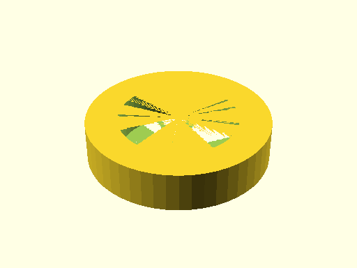
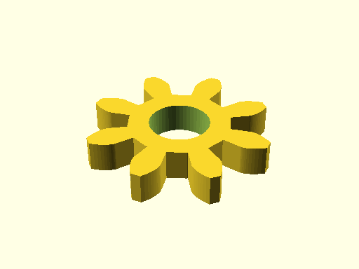

# Test Report: `test_file_generation.ScadGenerationMatrixTests.test_capability_motion_drive`

- Status: **FAIL**
- Timestamp: `2026-03-29T14:34:39`
- Artifact folder: `C:/gh/oomlout_oobb_version_5/tests/test_runs/test_file_generation_ScadGenerationMatrixTests_test_capability_motion_drive`

## Notes

Capability: `capability_motion_drive`
Artifact output: `C:/gh/oomlout_oobb_version_5/tests/test_runs/test_file_generation_ScadGenerationMatrixTests_test_capability_motion_drive/capability_motion_drive/generated`
Buildable item types covered: `6`
Compared SCAD files: `18`
Compared JSON files: `18`
Compared YAML files: `18`
Compared TXT files: `18`
Compared PNG files: `18`

## Rendered previews

### oobb_part_bearing_6701_bearing_name/3dpr.png

### oobb_part_bearing_6701_bearing_name/laser.png

### oobb_part_bearing_6701_bearing_name/true.png

### oobb_part_gear_1_diameter_3_mm_depth_8_teeth_extra/3dpr.png

### oobb_part_gear_1_diameter_3_mm_depth_8_teeth_extra/laser.png

### oobb_part_gear_1_diameter_3_mm_depth_8_teeth_extra/true.png

## Changed bits

### scad_hashes
- changed `oobb_part_pulley_gt2_1_diameter_6_mm_depth_16_teeth_shield_extra/3dpr.scad`\n  - expected: `3680b8df32e179a3a5121510c78e2bedc24dd6ebade30bc268ea957ebfdbd9ac`\n  - actual:   `954032f4348fb9a1f5d26adf346fd58c00188317d5331d32da5f3eb740de17cd`
- changed `oobb_part_pulley_gt2_1_diameter_6_mm_depth_16_teeth_shield_extra/laser.scad`\n  - expected: `67a09bc13955693f1923deeec0096245b31064e7302af2ec8ee444e18a5460fc`\n  - actual:   `a822eb315870b89d0a7da14e48966460be345782350c908a4f0fe4a1bd3a00f8`
- changed `oobb_part_pulley_gt2_1_diameter_6_mm_depth_16_teeth_shield_extra/true.scad`\n  - expected: `67a09bc13955693f1923deeec0096245b31064e7302af2ec8ee444e18a5460fc`\n  - actual:   `a822eb315870b89d0a7da14e48966460be345782350c908a4f0fe4a1bd3a00f8`
### capability_motion_drive
- changed `scad_hashes`\n  - expected: `{'oobb_part_bearing_6701_bearing_name/3dpr.scad': '8ac2823bd3c72744cb23134d67b7851dde5cdc440d3c4b16d49b91a3bc44dc95', 'oobb_part_bearing_6701_bearing_name/laser.scad': '98661fa2c46f4d8c901fcf4ec94c3bff5cbebedf222136f52ebd13ece5ba4eac', 'oobb_part_bearing_6701_bearing_name/true.scad': '98661fa2c46f4d8c901fcf4ec94c3bff5cbebedf222136f52ebd13ece5ba4eac', 'oobb_part_gear_1_diameter_3_mm_depth_8_teeth_extra/3dpr.scad': '73870e2d3975614c424b9c986e3c60bd99599fd7c94215978bb00e58721dd484', 'oobb_part_gear_1_diameter_3_mm_depth_8_teeth_extra/laser.scad': '4a914b1e88f6b4f5d54f021061fbc1759fafedf072e0ad83978b1ad6780c28b5', 'oobb_part_gear_1_diameter_3_mm_depth_8_teeth_extra/true.scad': '4a914b1e88f6b4f5d54f021061fbc1759fafedf072e0ad83978b1ad6780c28b5', 'oobb_part_pulley_gt2_1_diameter_6_mm_depth_16_teeth_shield_extra/3dpr.scad': '3680b8df32e179a3a5121510c78e2bedc24dd6ebade30bc268ea957ebfdbd9ac', 'oobb_part_pulley_gt2_1_diameter_6_mm_depth_16_teeth_shield_extra/laser.scad': '67a09bc13955693f1923deeec0096245b31064e7302af2ec8ee444e18a5460fc', 'oobb_part_pulley_gt2_1_diameter_6_mm_depth_16_teeth_shield_extra/true.scad': '67a09bc13955693f1923deeec0096245b31064e7302af2ec8ee444e18a5460fc', 'oobb_part_shaft_0_mm_depth/3dpr.scad': 'e3509a75bc586dac2f48d1dbb4bb27eeb4b2777c67a885cb586daf4cc81642f1', 'oobb_part_shaft_0_mm_depth/laser.scad': '6b185cdaf9f1618130d822053335ae5bae385592d7090f06006eb05119540759', 'oobb_part_shaft_0_mm_depth/true.scad': '6b185cdaf9f1618130d822053335ae5bae385592d7090f06006eb05119540759', 'oobb_part_shaft_coupler_2_diameter_9_mm_depth/3dpr.scad': '4981da02b798f0b7dc00134aae9b1fb7b62a2445c27ddda2e3242110f4e5251d', 'oobb_part_shaft_coupler_2_diameter_9_mm_depth/laser.scad': '4981da02b798f0b7dc00134aae9b1fb7b62a2445c27ddda2e3242110f4e5251d', 'oobb_part_shaft_coupler_2_diameter_9_mm_depth/true.scad': '4981da02b798f0b7dc00134aae9b1fb7b62a2445c27ddda2e3242110f4e5251d', 'oobb_part_wheel_1_diameter_6_mm_depth_314_oring_type/3dpr.scad': '2b15a85eb62798fca99621a51fdfef9b4d75fa4fd2a143848d87f2c04557f219', 'oobb_part_wheel_1_diameter_6_mm_depth_314_oring_type/laser.scad': '2b15a85eb62798fca99621a51fdfef9b4d75fa4fd2a143848d87f2c04557f219', 'oobb_part_wheel_1_diameter_6_mm_depth_314_oring_type/true.scad': '2b15a85eb62798fca99621a51fdfef9b4d75fa4fd2a143848d87f2c04557f219'}`\n  - actual:   `{'oobb_part_bearing_6701_bearing_name/3dpr.scad': '8ac2823bd3c72744cb23134d67b7851dde5cdc440d3c4b16d49b91a3bc44dc95', 'oobb_part_bearing_6701_bearing_name/laser.scad': '98661fa2c46f4d8c901fcf4ec94c3bff5cbebedf222136f52ebd13ece5ba4eac', 'oobb_part_bearing_6701_bearing_name/true.scad': '98661fa2c46f4d8c901fcf4ec94c3bff5cbebedf222136f52ebd13ece5ba4eac', 'oobb_part_gear_1_diameter_3_mm_depth_8_teeth_extra/3dpr.scad': '73870e2d3975614c424b9c986e3c60bd99599fd7c94215978bb00e58721dd484', 'oobb_part_gear_1_diameter_3_mm_depth_8_teeth_extra/laser.scad': '4a914b1e88f6b4f5d54f021061fbc1759fafedf072e0ad83978b1ad6780c28b5', 'oobb_part_gear_1_diameter_3_mm_depth_8_teeth_extra/true.scad': '4a914b1e88f6b4f5d54f021061fbc1759fafedf072e0ad83978b1ad6780c28b5', 'oobb_part_pulley_gt2_1_diameter_6_mm_depth_16_teeth_shield_extra/3dpr.scad': '954032f4348fb9a1f5d26adf346fd58c00188317d5331d32da5f3eb740de17cd', 'oobb_part_pulley_gt2_1_diameter_6_mm_depth_16_teeth_shield_extra/laser.scad': 'a822eb315870b89d0a7da14e48966460be345782350c908a4f0fe4a1bd3a00f8', 'oobb_part_pulley_gt2_1_diameter_6_mm_depth_16_teeth_shield_extra/true.scad': 'a822eb315870b89d0a7da14e48966460be345782350c908a4f0fe4a1bd3a00f8', 'oobb_part_shaft_0_mm_depth/3dpr.scad': 'e3509a75bc586dac2f48d1dbb4bb27eeb4b2777c67a885cb586daf4cc81642f1', 'oobb_part_shaft_0_mm_depth/laser.scad': '6b185cdaf9f1618130d822053335ae5bae385592d7090f06006eb05119540759', 'oobb_part_shaft_0_mm_depth/true.scad': '6b185cdaf9f1618130d822053335ae5bae385592d7090f06006eb05119540759', 'oobb_part_shaft_coupler_2_diameter_9_mm_depth/3dpr.scad': '4981da02b798f0b7dc00134aae9b1fb7b62a2445c27ddda2e3242110f4e5251d', 'oobb_part_shaft_coupler_2_diameter_9_mm_depth/laser.scad': '4981da02b798f0b7dc00134aae9b1fb7b62a2445c27ddda2e3242110f4e5251d', 'oobb_part_shaft_coupler_2_diameter_9_mm_depth/true.scad': '4981da02b798f0b7dc00134aae9b1fb7b62a2445c27ddda2e3242110f4e5251d', 'oobb_part_wheel_1_diameter_6_mm_depth_314_oring_type/3dpr.scad': '2b15a85eb62798fca99621a51fdfef9b4d75fa4fd2a143848d87f2c04557f219', 'oobb_part_wheel_1_diameter_6_mm_depth_314_oring_type/laser.scad': '2b15a85eb62798fca99621a51fdfef9b4d75fa4fd2a143848d87f2c04557f219', 'oobb_part_wheel_1_diameter_6_mm_depth_314_oring_type/true.scad': '2b15a85eb62798fca99621a51fdfef9b4d75fa4fd2a143848d87f2c04557f219'}`
