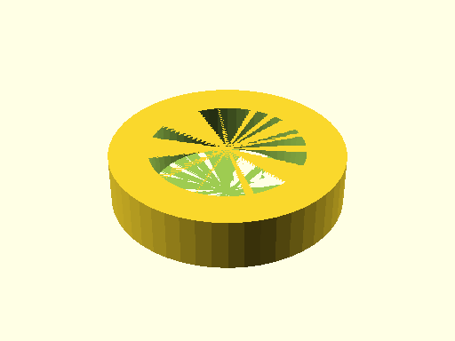
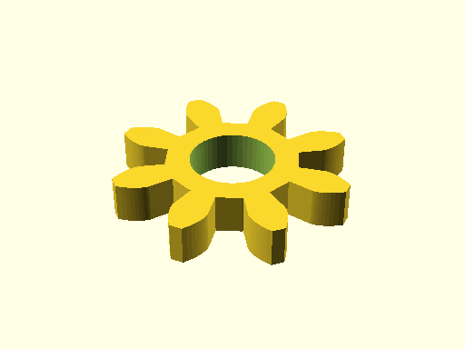

# Test Report: `tests.test_file_generation.ScadGenerationMatrixTests.test_capability_motion_drive`

- Status: **PASS**
- Timestamp: `2026-03-29T14:35:08`
- Artifact folder: `c:/gh/oomlout_oobb_version_5/tests/test_runs/tests_test_file_generation_ScadGenerationMatrixTests_test_capability_motion_drive`

## Notes

Capability: `capability_motion_drive`
Artifact output: `c:/gh/oomlout_oobb_version_5/tests/test_runs/tests_test_file_generation_ScadGenerationMatrixTests_test_capability_motion_drive/capability_motion_drive/generated`
Buildable item types covered: `6`
Compared SCAD files: `18`
Compared JSON files: `18`
Compared YAML files: `18`
Compared TXT files: `18`
Compared PNG files: `18`

## Rendered previews

### oobb_part_bearing_6701_bearing_name/3dpr.png

### oobb_part_bearing_6701_bearing_name/laser.png

### oobb_part_bearing_6701_bearing_name/true.png

### oobb_part_gear_1_diameter_3_mm_depth_8_teeth_extra/3dpr.png

### oobb_part_gear_1_diameter_3_mm_depth_8_teeth_extra/laser.png

### oobb_part_gear_1_diameter_3_mm_depth_8_teeth_extra/true.png

